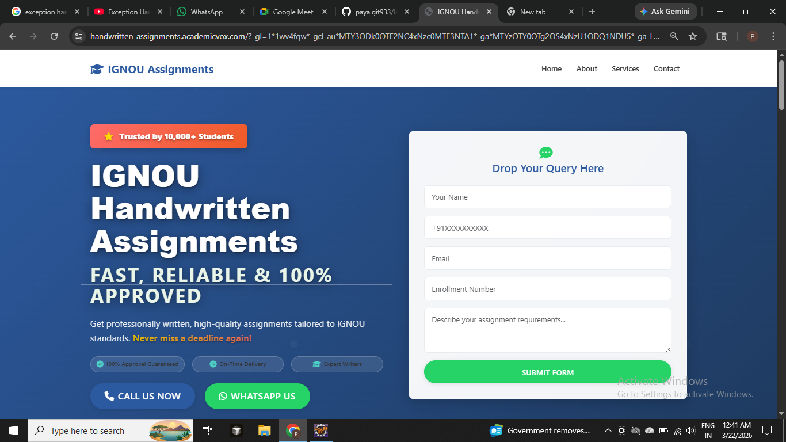
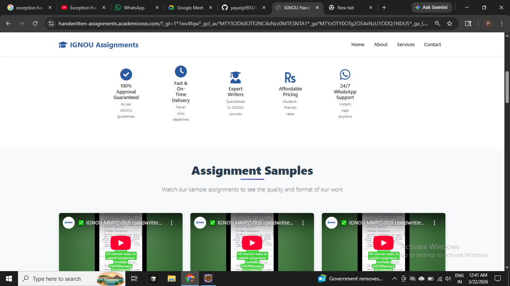
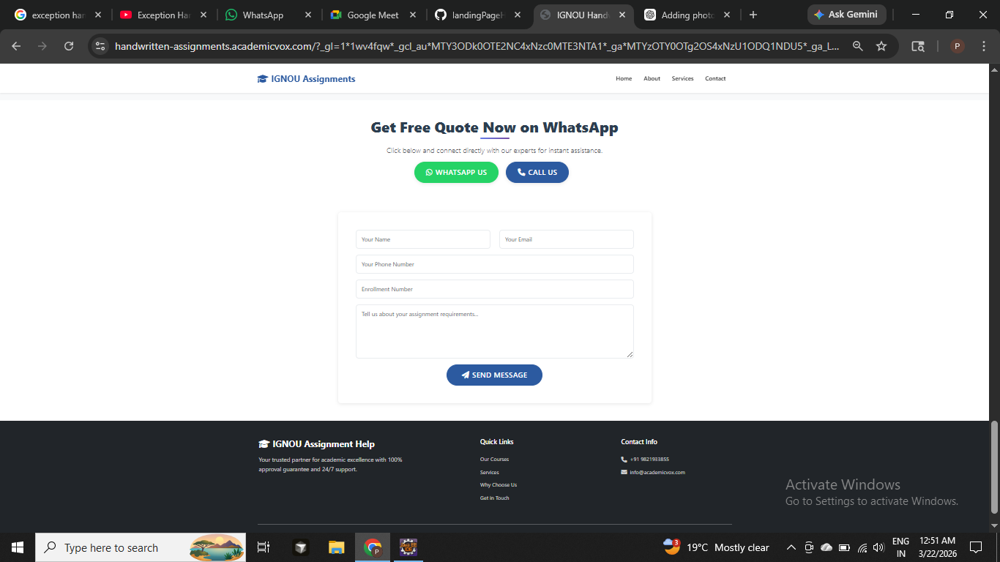

# 🌐 Academic Vox Landing Page

A fully functional **landing page** developed for the **Academic Vox** website.
This project focuses on user interaction, navigation, and real-time communication features.

---

## 🚀 Live Website

---

## ✨ Features

✔️ Responsive Landing Page Design
✔️ Functional Form Submission
✔️ Clickable Navigation Buttons
✔️ WhatsApp Service Section
✔️ Contact Form Message Sending
✔️ Clean and User-Friendly Layout

---

## 🛠️ Technologies Used

* 🌐 HTML5
* 🎨 CSS3
* ⚡ JavaScript

---

## 📸 Screenshots

  
  
  

---

## 📌 Project Highlights

* Designed a structured and visually appealing landing page
* Integrated multiple platform redirections
* Implemented working contact and WhatsApp interaction
* Focused on usability and accessibility
